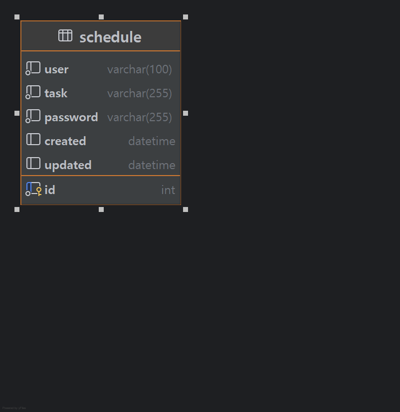

# 🗓️ My Schedule Planner

# :dart: **필수 기능 2LV 구현**

## :white_check_mark: **Lv 0. API 명세 및 ERD 작성**
API 명세서와 ERD를 작성하여 프로젝트의 전반적인 구조를 구상합니다.

## :calendar: **Lv 1. 일정 생성 및 조회**
사용자가 새로운 일정을 생성하고, 기존 일정을 조회할 수 있는 기능을 구현합니다.

## :wrench: **Lv 2. 일정 수정 및 삭제**
일정을 수정하거나 삭제할 수 있는 기능을 추가합니다.

# API 명세서

<details>
  <summary>📌 일정 생성 API </summary>

### 일정 생성 API 명세 (POST `/planners/Post/`)

| 항목           | 설명                |
|--------------|-------------------|
| **URL**      | `/planners/Post/` |
| **Method**   | `POST`            |
| **설명**       | 새로운 일정을 생성합니다.    |
| **Request**  | JSON Body (아래 참고) |
| **Response** | 등록 성공 메시지 + ID    |
| **Status**   | `201 Created`     |

#### 📦 Request Body

| 필드명        | 타입       | 설명     | 필수 여부 |
|------------|----------|--------|-------|
| `task`     | `String` | 할일     | ✅     |
| `user`     | `String` | 사용자 이름 | ✅     |
| `password` | `String` | 비밀번호   | ✅     |

```json
{
  "task": "낚시",
  "user": "우진",
  "password": "1234"
}
```

#### 📨 Response Body (성공 시)

```json
{
  "id": 1,
  "user": "우진",
  "task": "낚시",
  "created": "2025-05-14",
  "updated": "2025-05-14"
}
```

---

### 🔁 상태 코드 요약

| 코드            | 의미                |
|---------------|-------------------|
| `201 Created` | 일정 등록 성공          |

---
</details>

<details>
  <summary>📚 전체 일정 조회 API</summary>

### 전체 일정 조회 API 명세 (GET `/planners/All/`)

| 항목           | 설명                |
|--------------|-------------------|
| **URL**      | `/planners/All/`  |
| **Method**   | `GET`             |
| **설명**       | 등록된 전체 일정을 조회합니다. |
| **Request**  | 없음                |
| **Response** | 일정 리스트            |
| **Status**   | `200 OK`          |

#### 📨 Response Body (성공 시)

```json
[
  {
    "id": 1,
    "user": "우진",
    "task": "낚시",
    "created": "2025-05-14",
    "updated": "2025-05-14"
  },
  {
    "id": 2,
    "user": "진수",
    "task": "독서",
    "created": "2025-05-15",
    "updated": "2025-05-15"
  }
]
````

---

### 🔁 상태 코드 요약

| 코드       | 의미          |
|----------|-------------|
| `200 OK` | 전체 일정 조회 성공 |

</details>

<details>
  <summary>🔍 단건 일정 조회 API</summary>

### 단건 일정 조회 API 명세 (GET `/planners/{id}`)

| 항목           | 설명                          |
|--------------|-----------------------------|
| **URL**      | `/planners/{id}`            |
| **Method**   | `GET`                       |
| **설명**       | 특정 ID의 일정을 조회합니다.           |
| **Request**  | 경로 파라미터 (`id`)              |
| **Response** | 해당 일정 정보                    |
| **Status**   | `200 OK`, `404 Not Found` 등 |

#### 🔑 경로 파라미터

| 파라미터명 | 타입  | 설명         | 필수 여부 |
|-------|-----|------------|-------|
| `id`  | int | 조회할 일정의 ID | ✅     |

#### 📨 Response Body (성공 시)

```json
{
  "id": 1,
  "user": "우진",
  "task": "낚시",
  "created": "2025-05-14",
  "updated": "2025-05-14"
}
````

---

### 🔁 상태 코드 요약

| 코드              | 의미            |
|-----------------|---------------|
| `200 OK`        | 일정 조회 성공      |
| `404 Not Found` | 해당 ID의 일정이 없음 |

</details>

<details>
  <summary>✏️ 일정 수정 API</summary>

### 일정 수정 API 명세 (PUT `/planners/{id}`)

| 항목           | 설명                              |
|--------------|---------------------------------|
| **URL**      | `/planners/{id}`                |
| **Method**   | `PUT`                           |
| **설명**       | 특정 ID의 일정을 수정합니다.               |
| **Request**  | JSON Body (아래 참고)               |
| **Response** | 수정된 일정 정보                       |
| **Status**   | `200 OK`, `400`, `401`, `404` 등 |

#### 🧾 Path Variable

| 이름   | 타입    | 설명         | 필수 여부 |
|------|-------|------------|-------|
| `id` | `int` | 수정할 일정의 ID | ✅     |

#### 📦 Request Body

| 필드명        | 타입       | 설명         | 필수 여부 |
|------------|----------|------------|-------|
| `task`     | `String` | 수정할 할일 내용  | ✅     |
| `user`     | `String` | 작성자 이름     | ✅     |
| `password` | `String` | 일정 보호 비밀번호 | ✅     |

```json
{
  "task": "운동하기",
  "user": "우진",
  "password": "1234"
}
```

#### 📨 Response Body (성공 시)

```json
{
  "id": 1,
  "user": "우진",
  "task": "운동하기",
  "created": "2025-05-14",
  "updated": "2025-05-14T12:34:56"
}
```

---

### 🔁 상태 코드 요약

| 코드       | 의미                 |
|----------|--------------------|
| `200 OK` | 일정 수정 성공           |
| `400`    | 요청 형식 오류           |
| `401`    | 비밀번호 인증 실패         |
| `404`    | 해당 ID의 일정이 존재하지 않음 |

</details>

<details>
  <summary>🗑️ 일정 삭제 API</summary>

### 일정 삭제 API 명세 (DELETE `/planners/{id}`)

| 항목           | 설명                              |
|--------------|---------------------------------|
| **URL**      | `/planners/{id}`                |
| **Method**   | `DELETE`                        |
| **설명**       | 특정 ID의 일정을 삭제합니다.               |
| **Request**  | 경로 파라미터 + JSON Body             |
| **Response** | 삭제 성공 메시지                       |
| **Status**   | `200 OK`, `400`, `401`, `404` 등 |

#### 🔑 경로 파라미터

| 파라미터명 | 타입  | 설명         | 필수 여부 |
|-------|-----|------------|-------|
| `id`  | int | 삭제할 일정의 ID | ✅     |

#### 📦 Request Body (비밀번호 포함)

| 필드명        | 타입       | 설명       | 필수 여부 |
|------------|----------|----------|-------|
| `password` | `String` | 일정의 비밀번호 | ✅     |

```json
{
  "password": "1234"
}
````

#### 📨 Response Body (성공 시)

```json
{
  "message": "일정이 성공적으로 삭제되었습니다.",
  "id": 1
}
```

---

### 🔁 상태 코드 요약

| 코드       | 의미                 |
|----------|--------------------|
| `200 OK` | 일정 삭제 성공           |
| `400`    | 요청 형식 오류 또는 누락     |
| `401`    | 비밀번호 불일치           |
| `404`    | 해당 ID의 일정이 존재하지 않음 |

</details>

## 데이터 베이스
<details>
  <summary>📌 ERD </summary>

  ## 개념 설계

| **항목**    | **설명**            |
|-----------|-------------------|
| **일정 ID** | 고유 ID (숫자 또는 문자열) |
| **작성자**   | 일정을 작성한 사람 이름     |
| **할일**    | 할 일의 내용           |
| **비밀번호**  | 일정을 보호할 비밀번호      |
| **작성일**   | 일정을 처음 작성한 날짜     |
| **수정일**   | 마지막으로 수정된 날짜      |


## ERD

| **속성명**    | **타입**         | **설명**           |
|------------|----------------|------------------|
| `id`       | `INT` (PK)     | 일정 고유 ID (자동 증가) |
| `user`     | `VARCHAR(100)` | 일정을 작성한 사람의 이름   |
| `task`     | `VARCHAR(255)` | 할 일의 내용          |
| `password` | `VARCHAR(255)` | 일정을 보호할 비밀번호     |
| `created`  | `DATETIME`     | 일정을 처음 작성한 날짜    |
| `updated`  | `DATETIME`     | 마지막으로 수정된 날짜     |




</details>


